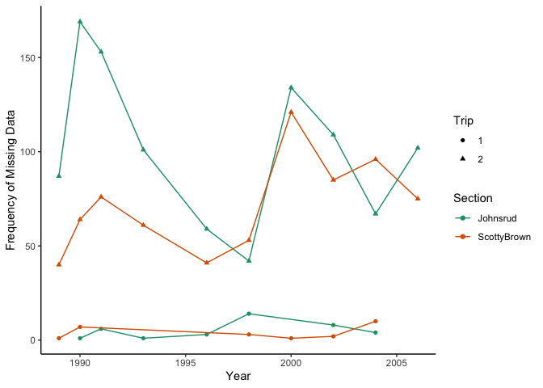
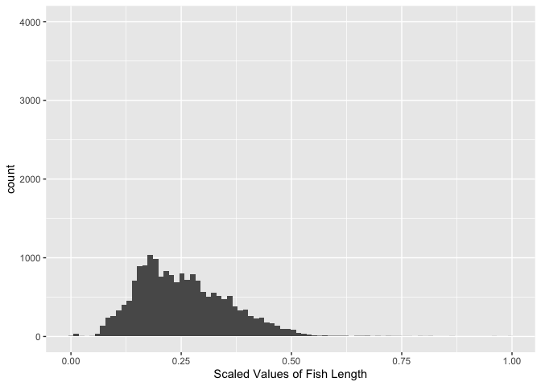

# Lab 8
Quinn Lynas

The goal of this lab is learn more about exploring missing data and
writing modular code.

## The Data

This lab’s data concerns mark-recapture data on four species of trout
from the Blackfoot River outside of Helena, Montana. These four species
are **rainbow trout (RBT)**, **westslope cutthroat trout (WCT)**, **bull
trout**, and **brown trout**.

Mark-recapture is a common method used by ecologists to estimate a
population’s size when it is impossible to conduct a census (count every
animal). This method works by *tagging* animals with a tracking device
so that scientists can track their movement and presence.

## Data Exploration

The measurements of each captured fish were taken by a biologist on a
raft in the river. The lack of a laboratory setting opens the door to
the possibility of measurement errors.

**1a. Let’s look for missing values in the dataset. Output ONE table
that answers BOTH of the following questions:**

- **How many observations have missing values?**
- **What variable(s) have missing values present?**

<!-- ::: callout-tip -->
<!-- # You should use `across()`! -->
<!-- ::: -->

``` r
fish |>
  summarise(across(.cols = 1:7, ~sum(is.na(.))))
```

    # A tibble: 1 × 7
       trip  mark length weight  year section species
      <int> <int>  <int>  <int> <int>   <int>   <int>
    1     0     0      0   1796     0       0       0

**1b. Using `map_int()`, produce a nicely formatted table of the number
of missing values for each variable in the `fish` data that displays the
same information as 1a**

``` r
fish |>
  map_int(~sum(is.na(.)))
```

       trip    mark  length  weight    year section species 
          0       0       0    1796       0       0       0 

**2. Create ONE thoughtful visualization that explores the frequency of
missing values across the different years, sections, and trips.**

``` r
fish |>
  filter(if_any(.cols = 1:7, is.na)) |>
  group_by(year, section, trip) |>
  summarise(n = n()) |>
  ggplot(aes(x = year, y = n, color = section, shape = factor(trip))) + 
  geom_point() +
  geom_line() + 
  labs(shape = "Trip", color = "Section", x = "Year", y = "Frequency of Missing Data") + 
  scale_color_brewer(palette = "Dark2") + 
  theme_classic()
```

    `summarise()` has grouped output by 'year', 'section'. You can override using
    the `.groups` argument.



## Rescaling the Data

If I wanted to rescale every quantitative variable in my dataset so that
they only have values between 0 and 1, I could use this formula:

I might write the following `R` code to carry out the rescaling
procedure for the `length` and `weight` columns of the `BlackfoorFish`
data:

``` r
fish |> 
  mutate(length = (length - min(length, na.rm = TRUE)) / 
           (max(length, na.rm = TRUE) - min(length, na.rm = TRUE)), 
         weight = (weight - min(weight, na.rm = TRUE)) / 
           (max(weight, na.rm = TRUE) - min(length, na.rm = TRUE)))
```

This process of duplicating an action multiple times can make it
difficult to understand the intent of the process. *Additionally, it can
make it very difficult to spot mistakes.*

**3. What is the mistake I made in the above rescaling code?**

You reassigned the scaled values to the original. Instead a new variable
should be created for scaled value.

When you find yourself copy-pasting lines of code, it’s time to write a
function, instead!

**4. Transform the repeated process above into a `rescale_01()`
function. Your function should…**

- **… take a single vector as input.**
- **… return the rescaled vector.**

``` r
rescale_01 <- function(x){
  if(!is.numeric(x) | length(x) <= 1) {
    stop(domain = "please enter a numeric vector with length > 1")
    }
  x1 = (x - min(x, na.rm = TRUE)) / (max(x, na.rm = TRUE) - min(x, na.rm = TRUE))
  x1
}
```

<!-- ::: callout-tip -->
<!-- # Efficiency  -->
<!-- Think about the efficiency of the function you wrote. Are you calling the -->
<!-- **same** function multiple times? You might want to look into the `range()`  -->
<!-- function.  -->
<!-- ::: -->

**5. Let’s incorporate some input validation into your function. Modify
your previous code so that the function stops if …**

- **… the input vector is not numeric.**
- **… the length of the input vector is not greater than 1.**

<!-- ::: callout-tip -->
<!-- # Modify Previous Code -->
<!-- Do not create a new code chunk here -- simply add these stops to your function -->
<!-- above! -->
<!-- ::: -->

## Test Your Function

**6. Run the code below to test your function. Verify that the maximum
of your rescaled vector is 1 and the minimum is 0!**

``` r
x <- c(1:25, NA)

rescaled <- rescale_01(x)
min(rescaled, na.rm = TRUE)
```

    [1] 0

``` r
max(rescaled, na.rm = TRUE)
```

    [1] 1

Next, let’s test the function on the `length` column of the
`BlackfootFish` data.

**7. The code below makes a histogram of the original values of
`length`. Add a plot of the rescaled values of `length`. Output your
plots side-by-side, so the reader can confirm the only aspect that has
changed is the scale.**

<!-- ::: callout-warning -->
<!-- This will require you to call your `rescale_01()` function within a `mutate()` -->
<!-- statement in order to create a `length_scaled` variable. -->
<!-- ::: -->

``` r
p1 <- fish |>  
  ggplot(aes(x = length)) + 
  geom_histogram(binwidth = 10) +
  labs(x = "Original Values of Fish Length (mm)") +
  scale_y_continuous(limits = c(0,4000))

# Code for Q7 plot.

p2 <- fish |>
  mutate(length = rescale_01(length)) |>  
  ggplot(aes(x = length)) + 
  geom_histogram( binwidth = 0.012) +
  labs(x = "Scaled Values of Fish Length") +
  scale_y_continuous(limits = c(0,4000))

p1
```


``` r
p2
```



<!-- ::: callout-tip -->
<!-- 1. Set the y-axis limits for both plots to go from 0 to 4000 to allow for direct comparison across plots. -->
<!-- 2. Pay attention to `binwidth`! -->
<!-- 3. Use a Quarto code chunk option to put the plots side-by-side. -->
<!-- ::: -->

## Challenge: Use Variables within a Dataset

Suppose you would like for your `rescale()` function to perform
operations on a **variable within a dataset**. Ideally, your function
would take in a data frame and a variable name as inputs and return a
data frame where the variable has been rescaled.

**8. Create a `rescale_column()` function that accepts two arguments:**

- **a dataframe**
- **the name(s) of the variable(s) to be rescaled**

**The body of the function should call the original `rescale_01()`
function you wrote previously. Your solution MUST use one of the `rlang`
options from class.**

<!-- ::: callout-tip -->
<!-- If you are struggling with this task, I recommend looking back over the  -->
<!-- [data frame functions](https://r4ds.hadley.nz/functions.html#data-frame-functions) -->
<!-- section of R for Data Science! -->
<!-- ::: -->

``` r
rescale_column <- function(df, col.names){
  l = length(col.names)
  rows <- dim(df)[1]
  out = matrix(NA, nrow = rows, ncol = l)
  for(i in 1:l){
    col <- col.names[i]
    out[,i] = rescale_01(df[[col]])
  }
  colnames(out) = col.names
  data.frame(out)
}
```

**9. Use your `rescale_column()` function to rescale *both* the `length`
and `weight` columns.**

<!-- ::: callout-warning -->
<!-- I expect that you carry out this process by calling the `rescale_column()` function only ONE time! -->
<!-- ::: -->

``` r
head(rescale_column(fish, col.names = c("length", "weight")), 10)
```

          length      weight
    1  0.2804124 0.037417148
    2  0.2804124 0.040624332
    3  0.2773196 0.052384007
    4  0.3154639 0.058798375
    5  0.3051546 0.064143682
    6  0.3577320 0.081248664
    7  0.2608247 0.036348086
    8  0.1484536 0.008552491
    9  0.2030928 0.017104982
    10 0.1453608 0.007483430
